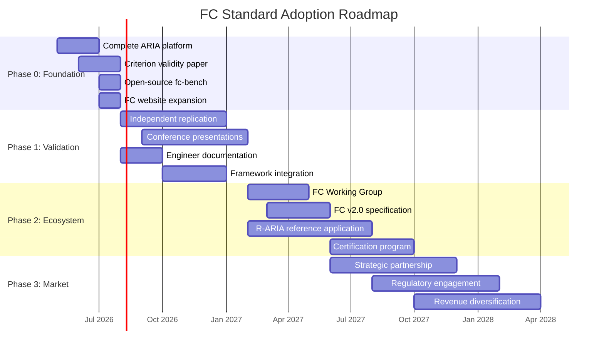

# ARIA Playbook: Establishing FC as an Industry Standard

## The Strategic Model

This playbook adapts the proven "standard-setting" strategy used by ARM (chip architecture licensing), Bluetooth SIG (connectivity standard), BLEU/MMLU (AI evaluation metrics), and Kubernetes/CNCF (cloud orchestration) to the specific case of **Functional Consciousness (FC)** as the standard metric for AI agent quality, with **ARIA** as the reference architecture.

The core insight from all successful standard-setting plays:

> **You don't sell the implementation. You sell the language.** Once everyone measures agents in FC scores, you are the authority regardless of who builds the agents.

---

## Historical Precedents and What They Teach

| Standard | Originator | What They Gave Away | What They Kept | Revenue Model |
|---|---|---|---|---|
| ARM | Acorn/ARM Ltd | ISA specification | Chip design IP | Per-unit licensing royalties |
| Bluetooth | Ericsson | Protocol specification | SIG membership + certification | Certification fees + membership |
| BLEU | IBM Research | Metric + reference code | Academic authority | Reputation → hiring → grants |
| MMLU | UC Berkeley | Dataset + scoring code | Benchmark authority | Reputation → influence → funding |
| Kubernetes | Google | Container orchestration | Cloud market positioning (GKE) | Cloud revenue + ecosystem control |
| OAuth | Twitter/Google | Protocol specification | Reference implementations | Platform lock-in |

### The Pattern

1. **Give away the metric freely** — this is counter-intuitive but essential
2. **Make it easy to adopt** — tools, libraries, one-line integrations
3. **Retain authority over the specification** — you define what version 2.0 looks like
4. **Build the reference implementation** — the "canonical" way to do it
5. **Monetize the ecosystem, not the standard** — certification, consulting, enterprise features

---

## The BLEU/MMLU Lesson (Most Relevant to FC)

FC is a *metric*, not a product. The closest precedents are BLEU and MMLU:

**What made BLEU succeed:**
- Solved a real pain point (manual translation evaluation was slow and expensive)
- Automated, reproducible, cheap to compute
- Correlated well enough with human judgment to be useful
- Published with reference code anyone could run
- Became the common language — once papers report BLEU, new papers must too

**What made MMLU succeed:**
- Previous benchmarks were saturated — MMLU provided fresh headroom
- Covered enough domains to feel "general"
- Single clear number that companies could compete on
- Became the leaderboard metric for frontier model launches

**FC's opportunity:**
- Current agent evaluation has no standard metric — everyone uses ad-hoc benchmarks
- FC provides a *theoretically grounded* score, not just empirical performance
- The FSMA catalog (46 self-models, 10 domains) gives the metric internal structure
- FC uniquely captures what current benchmarks miss: self-awareness, ethical drift, meta-cognition
- The EU AI Act creates *regulatory demand* for exactly this kind of structured evaluation

---

## Phase 0: Foundation (You Are Here)

**Timeline**: Now – Month 3  
**Resources**: Solo + AI assistance  
**Cost**: ~€5K (compute, hosting, conference fees)

### Actions

#### 0.1 — Complete the ARIA Research Platform
- [ ] Finish ARIA implementation (the ~20-hour plan from aria-thread-context.md)
- [ ] Run the criterion validity experiment: agents with higher FCS outperform economically
- [ ] Document results rigorously — this is the *founding evidence*

#### 0.2 — Publish the Criterion Validity Result
- [ ] Write the companion paper: "Criterion Validity of the FC Metric: Evidence from Multi-Agent Economic Simulation"
- [ ] Target: AGI-2026 workshop or AAAI/NeurIPS workshop track (AI agents, consciousness, safety)
- [ ] The FC paper (Bergmann, AGI-2026) provides the theory; this paper provides the *evidence*

#### 0.3 — Open-Source the FC Measurement Battery
- [ ] Extract `fcs_estimate.py`, `interview.py`, and `aria-tests.md` into a standalone package
- [ ] Name it something memorable: **`fc-bench`** or **`consciousness-score`**
- [ ] Publish on GitHub with MIT license, pip-installable
- [ ] Write a README that lets anyone score their agent in 10 minutes
- [ ] Include a leaderboard template (a markdown table of known FC scores)

> [!IMPORTANT]
> **The open-source release is the single most important action.** Everything else depends on other people being able to compute FC scores for their own agents. If they can't, FC remains an academic curiosity. If they can, it becomes a language.

#### 0.4 — Create the FC Website
- [ ] Expand functional-consciousness.com beyond the paper
- [ ] Add: FC scoring tool (web-based, paste agent logs → get FCS)
- [ ] Add: Leaderboard of known agent architectures and their FC scores
- [ ] Add: "Score your agent" tutorial
- [ ] Add: FSMA catalog as a structured, searchable resource

### Phase 0 Success Criteria
- Working ARIA platform with 3 agents and FC scoring
- One published/preprinted criterion validity paper
- `fc-bench` on GitHub with >50 stars
- At least 3 external researchers/teams have computed FC scores for their agents

---

## Phase 1: Validation & Early Adoption

**Timeline**: Month 3 – Month 9  
**Resources**: 1–2 collaborators (academic or industry)  
**Cost**: ~€20K–50K (travel, student researcher, cloud compute)

### Actions

#### 1.1 — Get Independent Replication
This is non-negotiable for credibility. A metric proposed by one author and validated only by that author has limited authority.

- [ ] Contact 2–3 research groups working on agent architectures (Stanford Generative Agents group, Anthropic safety team, a European AI lab)
- [ ] Offer to help them compute FC scores for their architectures
- [ ] Goal: at least one independent paper that uses FC to evaluate agents you didn't build
- [ ] If they find problems with the metric, *this is good* — it shows the metric is being taken seriously enough to critique

#### 1.2 — Present at the Right Venues
Target venues where the *audience* matters more than the prestige:

| Venue | Why | What to Present |
|---|---|---|
| NeurIPS Agent workshop | Agent builders who need evaluation metrics | fc-bench tool + ARIA results |
| AAAI Safety track | Safety researchers who need quantitative safety metrics | FC as safety indicator |
| EU AI Act compliance conferences | Regulators and compliance teams | FC as structured transparency metric |
| LangChain / CrewAI community events | Framework developers | fc-bench integration guide |
| IBM Think / Microsoft Build | Enterprise AI decision-makers | FC for enterprise agent governance |

#### 1.3 — Write the "FC for Engineers" Guide
The FC paper is academic. Engineers need:
- "What FC is in 5 minutes" (blog post)
- "How to add FC scoring to your existing agent" (tutorial)
- "Why your agent needs self-models" (opinion piece / manifesto)
- "FC vs. MMLU vs. SWE-bench: what each measures" (comparison)

Publish these on the blog, cross-post to Hacker News, Reddit r/MachineLearning, and relevant Discords.

#### 1.4 — Build the First Integration
Pick one popular agent framework and build an official FC scoring plugin:

| Framework | Effort | Impact |
|---|---|---|
| LangGraph | Medium | Industry standard for stateful agents |
| CrewAI | Low | Popular, growing community |
| AutoGen | Medium | Microsoft ecosystem |
| Letta (MemGPT) | Low | Already memory-focused, natural fit |

The plugin should let developers add `fc_score = fc_bench.evaluate(agent)` to their existing code. This is how BLEU became standard — it was easy to add to existing pipelines.

### Phase 1 Success Criteria
- At least 1 independent paper using FC
- fc-bench has >500 GitHub stars and >10 contributors
- FC scores reported in at least 3 agent benchmark papers
- One framework integration (LangGraph or CrewAI) live and documented
- One invited talk at a major venue

---

## Phase 2: Ecosystem Building

**Timeline**: Month 9 – Month 18  
**Resources**: 2–3 people + advisory board  
**Cost**: ~€100K–200K (small team, compute, events)

### Actions

#### 2.1 — Establish the FC Working Group
A metric needs stewardship. Create a lightweight governance structure:

- **Name**: "FC Consortium" or "Functional Consciousness Initiative" (FCI)
- **Members**: 5–10 researchers and practitioners from different organizations
- **Charter**: Maintain the FC specification, evolve the FSMA catalog, certify scoring tools
- **Hosted by**: An existing body if possible (Partnership on AI, OECD AI Policy Observatory, or a European AI institute) — or independent if necessary
- **Meetings**: Quarterly, online, open to observers

> [!TIP]
> You don't need a large consortium to start. ARM began with 12 employees. The Bluetooth SIG started with 5 companies. What matters is that the governance is *credible* and *vendor-neutral*, not large.

#### 2.2 — Publish FC Specification v2.0
Based on feedback from Phase 1:
- Address known issues (multiplicative aggregation formula, cross-reasoning formalization)
- Add new self-model domains if discovered
- Define FC scoring levels (e.g., FC-0 through FC-5, like autonomous driving levels)
- Publish as a formal technical report with version number and changelog

#### 2.3 — Build the R-ARIA Reference Application
Choose one high-value domain and build a deployable R-ARIA product:

**Recommended first target: Compliance monitoring for regulated industries**

Why:
- Regulatory demand is real and growing (EU AI Act, Basel III AI provisions, FDA AI guidance)
- The pain point is acute: companies *must* demonstrate AI transparency
- ARIA's inspectable architecture is a direct solution
- The customer has budget and urgency
- It positions FC as *the* metric for agent transparency

**Alternate targets:**
- Research coordination agent for pharmaceutical R&D
- Multi-stakeholder negotiation platform for M&A advisory

#### 2.4 — Develop the FC Certification Program
Once enough agents are being scored:
- Define "FC Certified" levels (analogous to Energy Star ratings)
- Offer certification for agent frameworks and products
- Revenue model: certification fees (modest — €5K–20K per product per year)
- Marketing value for certified products: "FC-5 Certified Agent"

### Phase 2 Success Criteria
- FC Working Group established with 5+ member organizations
- FC v2.0 specification published
- R-ARIA deployed in at least one paying customer environment
- FC Certification program launched with first 3 certified products
- FC scores appearing in product marketing materials (not just research papers)

---

## Phase 3: Market Establishment

**Timeline**: Month 18 – Month 36  
**Resources**: 4–8 people (small company or funded lab)  
**Cost**: ~€500K–1.5M (team, product development, business development)

### Actions

#### 3.1 — Strategic Partnership
Approach one large company for a strategic partnership. The pitch differs by company:

| Company | Pitch |
|---|---|
| **IBM** | "FC gives watsonx agents a differentiation layer that OpenAI can't match. You become the governance-first AI platform." |
| **Anthropic** | "FC operationalizes your safety mission into a measurable, deployable framework. Constitutional AI at training time + FC at runtime." |
| **Microsoft** | "FC Certification for Copilot agents gives enterprise customers the transparency guarantee they're asking for." |
| **European AI startups (Mistral, Aleph Alpha)** | "FC-certified agents position European AI as the trustworthy alternative. Sovereignty + transparency." |

#### 3.2 — Regulatory Engagement
- Submit FC as a proposed evaluation framework to EU AI Office
- Engage with NIST AI Risk Management Framework working groups
- Propose FC scoring as part of AI transparency requirements
- Position FC as the technical standard that implements regulatory intent

#### 3.3 — Revenue Diversification

| Revenue Stream | Description | Annual Estimate |
|---|---|---|
| FC Certification | Per-product annual certification fee | €50K–200K |
| R-ARIA Enterprise License | Full inspectable agent platform for regulated industries | €200K–500K per customer |
| Consulting & Training | FC implementation guidance for enterprise teams | €100K–300K |
| Research Grants | EU Horizon, NSF, DARPA funding for FC research | €200K–500K |
| Strategic Partnership | Revenue share or licensing from platform partner | Variable |

### Phase 3 Success Criteria
- At least one strategic partnership signed
- FC referenced in at least one regulatory framework or guidance document
- R-ARIA generating revenue from 3+ enterprise customers
- FC scores reported on agent product pages (like benchmark scores on GPU product pages)
- You are invited to regulatory consultations as a domain expert

---

## The Anti-Patterns: What Not to Do

These are the common failure modes for standard-setting plays:

### ❌ Don't Keep the Metric Proprietary
If people can't compute FC scores without your permission, they'll invent their own metric. BLEU won because IBM gave it away. FC must be freely computable by anyone.

### ❌ Don't Build the Product Before the Metric Has Traction
R-ARIA as a product is only valuable if FC is already a recognized metric. Building the product first and hoping the metric follows is backwards. The metric creates the market.

### ❌ Don't Try to Do Everything Alone
A metric proposed by one person and used by one person is not a standard. The single most important Phase 1 activity is getting *other people* to use FC. Every hour spent helping someone else compute an FC score is more valuable than every hour spent improving your own implementation.

### ❌ Don't Get Distracted by the "Consciousness" Debate
Philosophers will want to debate whether FC is "real" consciousness. This is a distraction. FC is a *functional* metric. It measures self-model richness and reasoning power. Whether that constitutes consciousness is an interesting philosophical question that is *irrelevant* to the engineering and business value of the metric. Stay in the engineering lane.

### ❌ Don't Wait for Perfection
The FC formula has known issues (multiplicative aggregation, cross-reasoning formalization). Ship it anyway. BLEU has well-documented flaws and has been the standard for 24 years. The first version that is *useful* beats the perfect version that ships two years late.

---

## Timeline Summary

---

## The One-Sentence Strategy

**Give away the metric, own the specification, build the reference implementation, and become the authority that companies pay to certify against — so that when the EU asks "how do we evaluate whether this agent is transparent and self-aware enough to deploy?", the answer is "compute its FC score."**

---

## Immediate Next Actions (This Week)

1. **Finish ARIA Phase 0-1** (world_tick.py + single agent running) — this is the prerequisite for everything
2. **Draft the fc-bench README** — even before the code is finished, write the README that describes what someone would `pip install` and what they'd get
3. **Identify 3 target researchers** for independent replication outreach
4. **Register `fc-bench` on GitHub** and reserve the PyPI package name
5. **Write the "FC in 5 Minutes" blog post** — this is the single artifact that will get shared most

> [!CAUTION]
> The window for establishing FC as the standard metric is finite. The industry is actively searching for agent evaluation frameworks right now (2026). If someone else publishes a competing metric with better tooling and community adoption before FC gains traction, the window closes. Speed of open-source release matters more than completeness of the metric.
